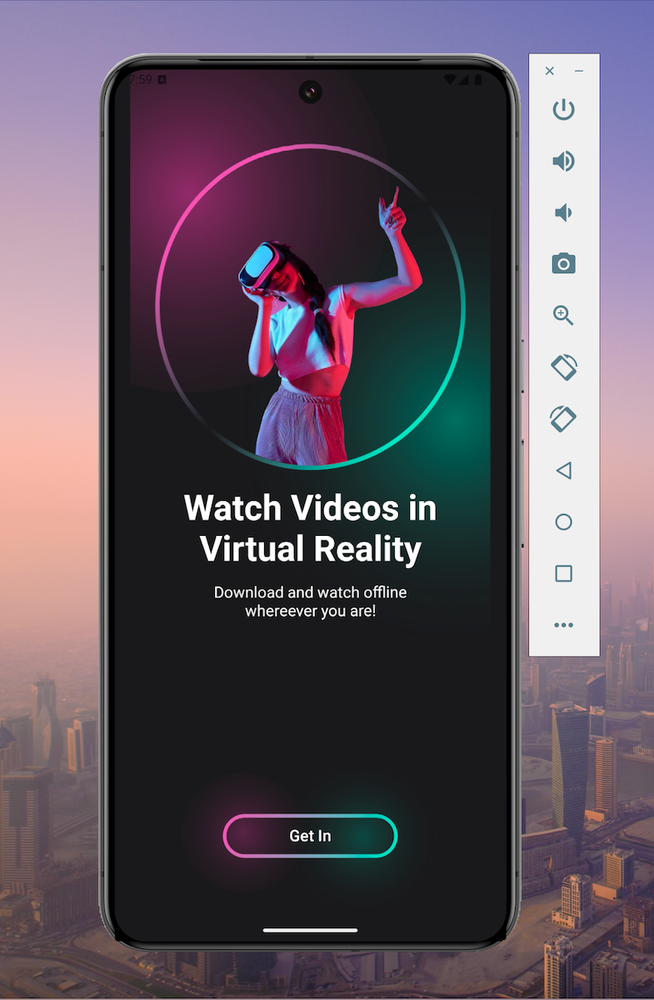
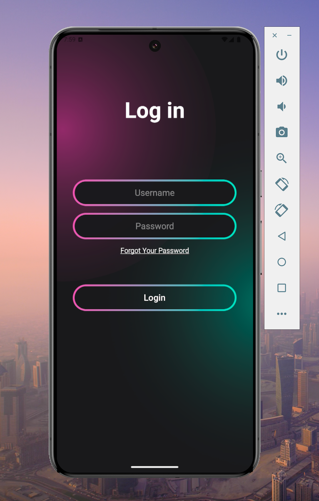
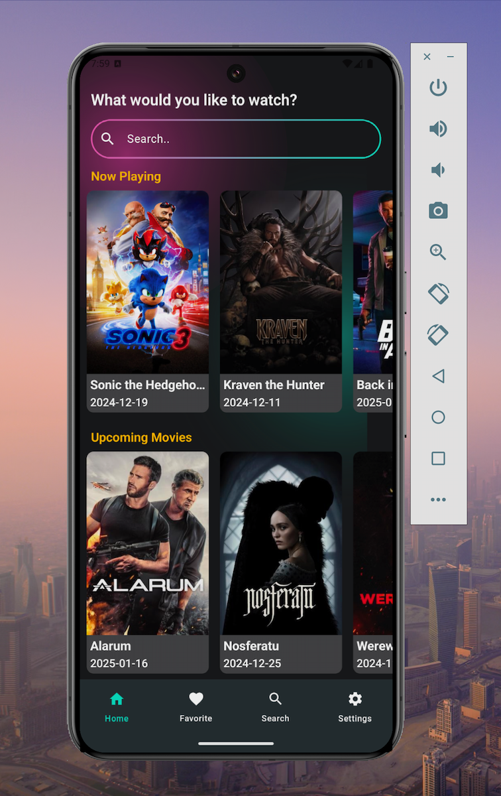
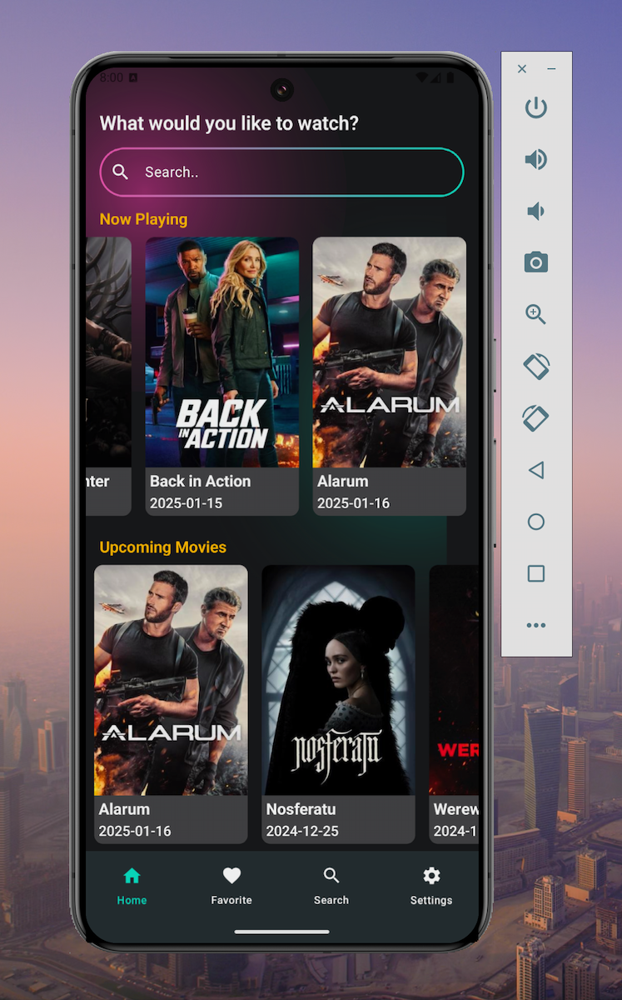
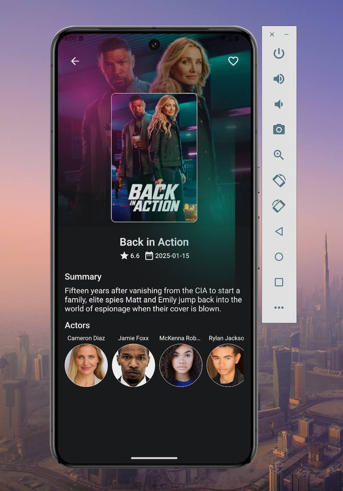
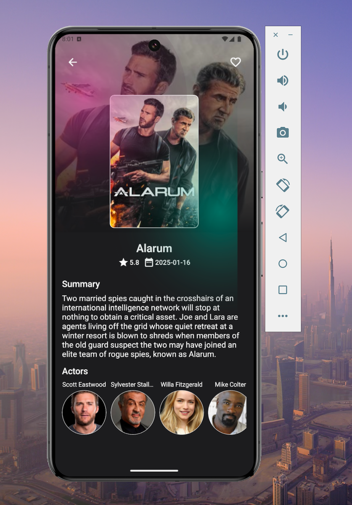
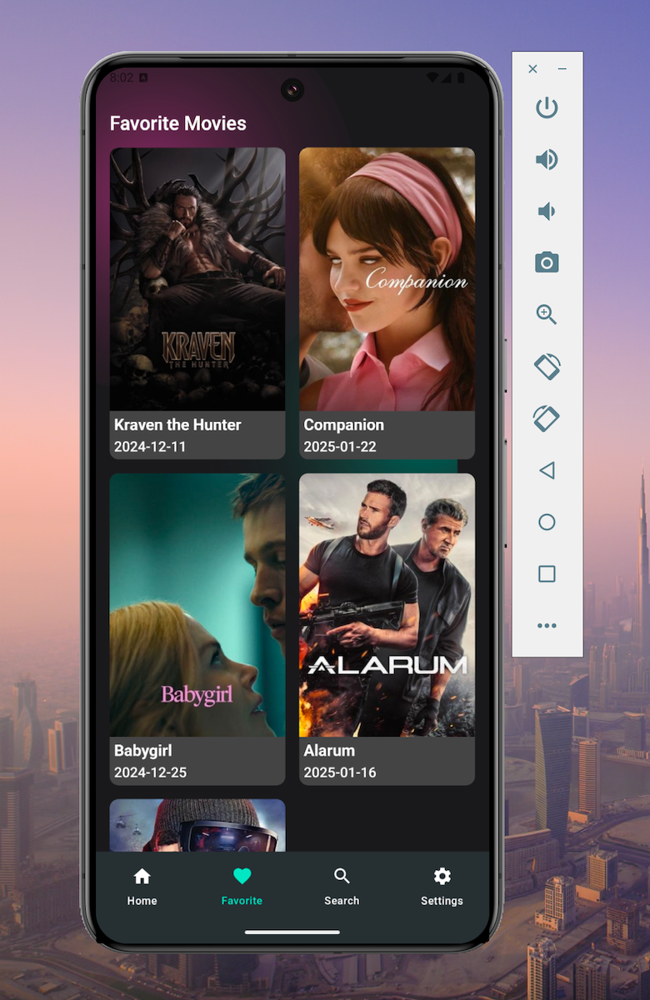

# MoviesApp-Comp

MoviesApp-Comp is an Android application built using Jetpack Compose to provide users with an engaging experience for discovering movies. The app
fetches information about Now Playing and Upcoming movies from [The Movie Database (TMDb)](https://www.themoviedb.org/), displays the list of movies,
and allows users to mark movies as favorites. The app follows modern Android development best practices and is built with a clean architecture
approach (MVI), using Kotlin, Jetpack Compose, and various libraries for efficient development.

## Features

- Displays Now Playing and Upcoming movies using The Movie Database (TMDb) API.
- Allows users to mark or unmark movies as favorites.
- User authentication through a login screen before accessing the main app.
- Splash screen upon app launch.
- Uses Ktor for API calls and kotlinx-serialization for JSON parsing.
- Image loading handled by Coil.
- Uses Room Database to persist favorite movies.
- Architecture follows MVI (Model-View-Intent) pattern and Clean Architecture principles.

## Architecture

This app follows a clean architecture structure with the following layers:

1. **Presentation Layer**:
    - Jetpack Compose UI.
    - MVI architecture to handle UI states and interactions.

2. **Domain Layer**:
    - Contains business logic and Use Cases.

3. **Data Layer**:
    - Ktor for making API calls to fetch movie data.
    - Room Database for storing favorite movies.

## Libraries Used

- **Jetpack Compose**: For building the UI in a declarative way.
- **Navigation Component (NavHost)**: For navigation between screens.
- **Ktor**: For making network API requests.
- **kotlinx-serialization**: For parsing JSON responses.
- **Coil**: For loading images efficiently.
- **Room Database**: For local storage of favorite movies.
- **Koin**: For Dependency Injection.

## Screenshots

Here are some screenshots of the app:

### Splash and Login Screen

 

### Movies List Screen

 

### Movie Detail Screen

 

### Favorite Movies



## Getting Started

### Prerequisites

Before running this project, ensure that you have the following installed:

- **Android Studio** (with the latest stable version)
- **JDK 11 or higher** installed
- **Gradle** (usually bundled with Android Studio)

### Installation

1. Clone the repository:

   ```bash
   git clone https://github.com/mik237/MoviesApp-Comp.git

2. Open the project in Android Studio.

3. Make sure you have the required API key for The Movie Database (TMDb):
    - Create an account on TMDb.
    - Generate an API key and add it to your project.
        - You can place it in the strings.xml or use it in your API calls directly.

4. Sync Gradle files and build the project.
5. Run the app on an emulator or real device.

### Screens & Navigation Flow

- **Splash Screen**: Displays briefly when the app starts, then navigates to the Login Screen.
- **Login Screen**: Allows users to authenticate (you can simulate login for testing).
- **Main Screen**: Displays a list of Now Playing and Upcoming Movies.
    - User can click on any movie item to navigate to the Movie Detail Screen.
- **Movie Detail Screen**: Displays detailed information about the selected movie.
    - Users can mark or unmark the movie as a favorite, which will be stored in the local Room Database.

### How It Works

1. Fetching Movies:
    - The app makes a request to The Movie Database API using Ktor and retrieves Now Playing and Upcoming movie lists.
    - These lists are then displayed in the Movies List screen.

2. Marking Favorites:
    - Users can mark any movie as a favorite. The app stores the movie in a local Room Database.
    - The movie is removed from the favorite list if the user unmarks it.

3. MVI Architecture:
    - The app uses the MVI (Model-View-Intent) architecture to separate UI, business logic, and state management.

4. Room Database:
    - Room is used to persist the favorite movies locally. When a movie is marked as a favorite, it gets inserted into the database and can be
      retrieved later.

## Contributing

Feel free to fork the repository, make changes, and create pull requests. Contributions are always welcome!

### Steps for contributing:

1. Fork the repository.
2. Clone your fork to your local machine.
3. Make your changes and commit them.
4. Push your changes to your forked repository.
5. Create a pull request for review.

License
This project is open source and available under the MIT License.

## Acknowledgements

- [The Movie Database API](https://www.themoviedb.org/) for providing the movie data.
- [Jetpack Compose](https://developer.android.com/jetpack/compose) for modern UI development.
- [Ktor](https://ktor.io/) for handling HTTP requests.
- [Coil](https://coil-kt.github.io/coil/) for efficient image loading.
- [Room Database](https://developer.android.com/training/data-storage/room) for local data persistence.
- [Koin](https://insert-koin.io/) for Dependency Injection in Kotlin.

